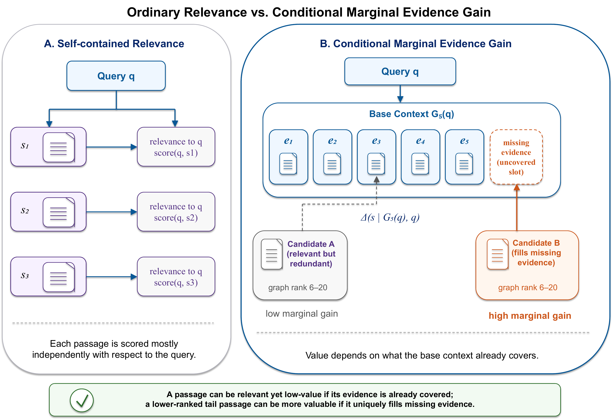
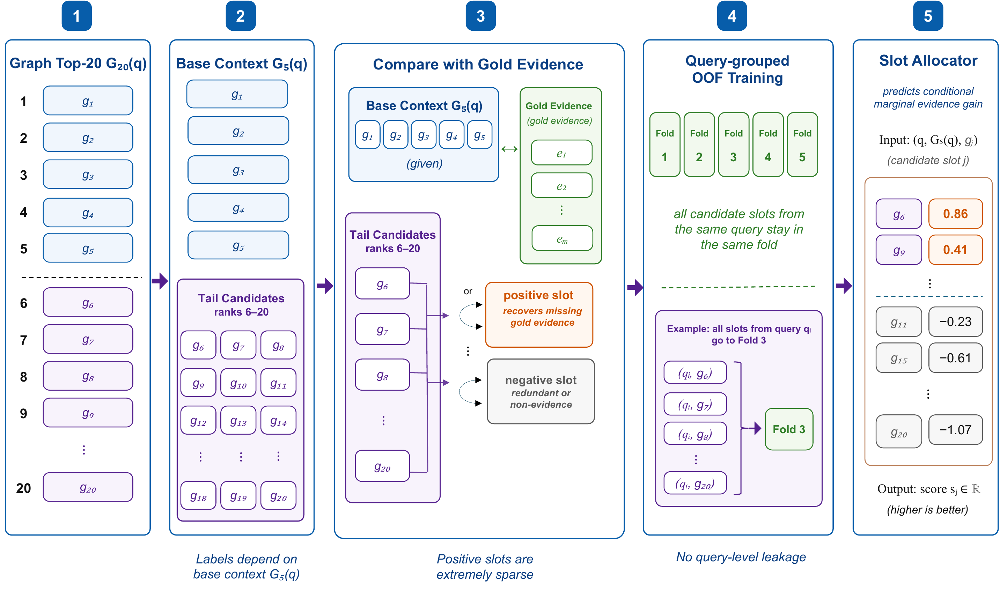

<div align="center">

<h1>MGEA: Marginal Graph Evidence Allocation for Efficient Graph-Augmented Retrieval</h1>

<p><strong>Accepted at the 27th International Conference on Web Information Systems Engineering (<a href="https://conferences.sigappfr.org/wise2026/">WISE 2026</a>) 🎉</strong></p>

<p>Jiaheng Zhang<sup>1,2</sup> · Daqiang Zhang<sup>2</sup></p>

<p><sup>1</sup> School of Mathematics (Zhuhai), Sun Yat-sen University<br>
<sup>2</sup> Shanghai Easun Technology Co., Ltd.</p>

<p><a href="#overview">Overview</a> · <a href="#installation">Installation</a> · <a href="#quick-start">Quick Start</a> · <a href="#data-format">Data Format</a> · <a href="#citation">Citation</a></p>

</div>

## News

- **2026** — MGEA was accepted at WISE 2026.
- **2026** — The official method implementation and reproducible command-line interface were released.

## Overview

Graph RAG systems typically send a fixed top-*k* block of retrieved graph passages to the reader, even though useful tail evidence is sparse and query-dependent. MGEA treats reader-context construction as a **conditional marginal allocation** problem: a passage is valuable only when it contributes evidence that the current base context does not already cover.

MGEA keeps the graph top-5 context, scores candidates at graph ranks 6-20 by their conditional marginal evidence gain, and selects a small number of tail passages under a global reader budget. The allocator is lightweight, requires no additional LLM calls, and can be placed on top of any ranked graph retriever.

The repository also includes the paper's optional **dense-probe triage** layer, which estimates whether graph retrieval should be invoked before paying its retrieval cost.

### Highlights

- **Conditional evidence value:** scores each tail passage relative to the evidence already covered by `G5(q)`.
- **Sparse budget allocation:** matches the paper setting of average context length 7 with at most 5 appended passages per query.
- **Leakage-safe evaluation:** keeps every candidate slot from the same query in the same out-of-fold split.
- **Retriever-agnostic design:** consumes precomputed dense and graph rankings without modifying graph construction or traversal.
- **Strong accuracy-cost trade-off:** improves over graph top-5 by **+3.6 EM / +3.96 F1** and matches graph top-8 with fewer prompt tokens.
- **Optional graph triage:** reduces graph invocation to **52.7%** and average retrieval latency from **6091 ms to 3002 ms** while preserving high recall.

## Conditional Marginal Evidence Gain

Conventional reranking estimates whether a passage is relevant to the query in isolation. MGEA instead estimates whether that passage adds evidence beyond the fixed base context:

$$
\Delta(s \mid G_5(q), q) = u(G_5(q) \cup \{s\}; q) - u(G_5(q); q).
$$

<p align="center">
  
</p>

<p align="center"><em>Ordinary relevance scores passages independently; MGEA rewards tail passages that fill evidence missing from the graph top-5 context. <a href="assets/figure4_marginal_evidence_gain.pdf">PDF</a></em></p>

## Slot Allocation Pipeline

For each query, MGEA applies the following procedure:

1. Take graph ranks 1-5 as the fixed base context `G5(q)`.
2. Treat graph ranks 6-20 as candidate evidence slots.
3. Label a candidate positive only if it recovers gold evidence missing from `G5(q)`.
4. Extract graph-rank, dense-support, marginal-novelty, and query-level probe features.
5. Train a standardized logistic regression with query-grouped out-of-fold evaluation.
6. Allocate the highest-scoring tail passages under the average and per-query budgets.

<p align="center">
  
</p>

<p align="center"><em>MGEA slot-label construction, query-grouped out-of-fold training, and conditional marginal scoring. <a href="assets/figure5_slot_allocation_pipeline.pdf">PDF</a></em></p>

## Installation

```bash
git clone https://github.com/jiaheng-math/MGEA.git
cd MGEA

conda env create -f environment.yml
conda activate mgea
pip install -e .
```

The implementation requires Python 3.10+, NumPy, scikit-learn, and joblib. Dense and graph retrieval systems are upstream components and are not required to install this package.

## Quick Start

### 1. Paper-style out-of-fold evaluation

```bash
mgea oof \
  --input data/retrieval.jsonl \
  --output outputs/oof_predictions.jsonl \
  --metrics outputs/oof_metrics.json \
  --base-k 5 \
  --max-k 20 \
  --target-avg-k 7 \
  --per-query-cap 5 \
  --folds 5 \
  --triage-rate 0.527 \
  --seed 42
```

### 2. Fit the final models

```bash
mgea fit \
  --input data/train_retrieval.jsonl \
  --model-output models/mgea.joblib
```

### 3. Allocate evidence for new queries

```bash
mgea predict \
  --input data/test_retrieval.jsonl \
  --model models/mgea.joblib \
  --output outputs/predictions.jsonl \
  --triage-rate 0.527
```

The prediction output includes the graph-invocation probability, triage decision, score for every tail candidate, selected tail passage IDs, MGEA graph context, and final reader context.

## Data Format

The input is JSONL with one query per line. Training and out-of-fold evaluation require `gold_passage_ids` or `gold_titles`; prediction does not require gold evidence.

```json
{
  "id": "q-001",
  "question": "Which city was the author of Book A born in?",
  "gold_passage_ids": ["book-a", "author-a"],
  "query_entities": ["Book A"],
  "retrieval": {
    "dense": [
      {
        "id": "book-a",
        "title": "Book A",
        "text": "...",
        "score": 18.2,
        "source_doc_id": "book-a"
      }
    ],
    "graph": [
      {
        "id": "author-a",
        "title": "Author A",
        "text": "...",
        "score": 0.91,
        "source_doc_id": "author-a"
      }
    ]
  }
}
```

For the paper configuration, provide at least 5 dense passages and 20 graph passages per query. Passage identifiers must use the same canonical document IDs as the gold evidence. `query_entities` is optional; the package uses a lightweight fallback when it is absent.

## Reproducibility Settings

| Component | Paper setting |
|---|---:|
| Base graph context | `G5(q)` |
| Tail candidate pool | Graph ranks 6-20 |
| Average reader budget | 7 passages |
| Maximum appended passages | 5 per query |
| Slot model | Standardized logistic regression |
| Slot class weighting | Balanced |
| Evaluation | 5-fold query-grouped OOF |
| Random seed | 42 |
| Triage target invocation rate | 52.7% |

## Repository Structure

```text
MGEA/
├── assets/                     # README figures in PNG and PDF
├── data/                       # local retrieval JSONL files
├── src/mgea/
│   ├── schema.py               # input schema and evidence matching
│   ├── features.py             # paper feature definitions
│   ├── slot_allocator.py       # marginal labels, OOF, and budget allocation
│   ├── triage.py               # dense-probe graph-invocation triage
│   └── cli.py                  # oof, fit, and predict commands
├── tests/test_mgea.py          # synthetic end-to-end validation
├── environment.yml
└── pyproject.toml
```

## Testing

```bash
python -m unittest discover -s tests -v
```

## Citation

If this repository is useful in your research, please cite:


## Contact

For questions about the method or code, please contact [Jiaheng Zhang](mailto:zhangjh535@mail2.sysu.edu.cn).
